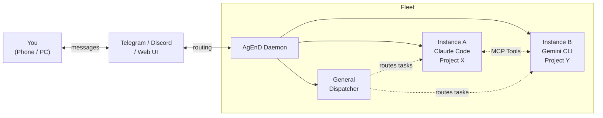

<p align="center">
  <h1 align="center">AgEnD</h1>
  <p align="center">
    <strong>Run a fleet of AI coding agents from your phone.</strong>
  </p>
  <p align="center">
    <a href="https://www.npmjs.com/package/@suzuke/agend"></a>
    <a href="LICENSE"></a>
    <a href="https://nodejs.org">= 20"></a>
  </p>
</p>

AgEnD (**Agent Engineering Daemon**) turns your Telegram or Discord into a command center for AI coding agents. One bot, multiple CLI backends, unlimited projects — each running as an independent session with crash recovery and zero babysitting.

<p align="center">
  <code>You → Telegram/Discord → AgEnD → Fleet of AI Agents → Results back to your phone</code>
</p>

[繁體中文](README.zh-TW.md) · [Documentation](docs/features.md) · [CLI Reference](docs/cli.md)

---

## Why AgEnD?

| Without AgEnD | With AgEnD |
|---|---|
| Close the terminal, agent goes offline | Runs as a system service — survives reboots |
| One terminal = one project | One bot, unlimited projects running in parallel |
| Long-running sessions accumulate stale context | Auto-rotates sessions by max age to stay fresh |
| No idea what your agents are doing overnight | Daily cost reports + hang detection alerts |
| Agents work in silos, can't coordinate | Peer-to-peer collaboration via MCP tools |
| Runaway costs from unattended sessions | Per-instance daily spending limits with auto-pause |

## Feature Highlights

🚀 **Fleet Management** — One bot, N projects. Each Telegram Forum Topic is an isolated agent session.

🔄 **Multi-Backend** — Claude Code, Gemini CLI, Codex, OpenCode, Kiro CLI. Switch or mix freely.

🤝 **Agent Collaboration** — Agents discover, wake, and message each other via MCP tools. A General Topic routes tasks to the right agent using natural language.

📱 **Mobile Control** — Approve tool use, restart sessions, and manage your fleet from Telegram inline buttons.

🛡️ **Autonomous & Safe** — Cost guards, hang detection, model failover, and crash recovery keep your fleet running without babysitting.

⏰ **Persistent Schedules** — Cron-based tasks backed by SQLite. Survives restarts.

🎤 **Voice Messages** — Talk to your agents with Groq Whisper transcription.

📄 **HTML Chat Export** — Export any agent session as a self-contained HTML file for sharing or archiving.

🪞 **Mirror Topic** — Cross-instance visibility. Watch another agent's work in real time from a separate topic.

🖥️ **Web Dashboard** — Live fleet monitoring in the browser with SSE updates and integrated chat UI.

🔌 **Extensible** — Discord adapter, webhook notifications, health endpoint, external session support via IPC.

## Quick Start

```bash
npm install -g @suzuke/agend    # 1. Install
agend quickstart                # 2. Setup — bot token, backend, done
agend fleet start               # 3. Launch your fleet 🎉
```

Open Telegram, send a message to your bot, and start coding from your phone.

> **Discord?** `agend quickstart` supports Discord too — install the plugin first: `npm install -g @suzuke/agend-plugin-discord`. See [Discord setup guide](docs/features.md#discord-adapter-mvp).

## How It Works



1. **You send a message** to your Telegram/Discord bot
2. Messages sent to the **General Topic** are interpreted and routed to the right agent. Messages to a specific topic go directly to that instance.
3. **Agent instances** run in isolated tmux sessions, each with its own project and CLI backend
4. **Agents collaborate** peer-to-peer via MCP tools — delegating tasks, sharing context, reporting results
5. **Results flow back** to your chat. Permission requests arrive as inline buttons.

## Supported Backends

| Backend | Install | Auth |
|---------|---------|------|
| Claude Code | `curl -fsSL https://claude.ai/install.sh \| bash` | `claude` (OAuth) or `ANTHROPIC_API_KEY` |
| OpenAI Codex | `npm i -g @openai/codex` | `codex` (ChatGPT login) or `OPENAI_API_KEY` |
| Gemini CLI | `npm i -g @google/gemini-cli` | `gemini` (Google OAuth) |
| OpenCode | `curl -fsSL https://opencode.ai/install \| bash` | `opencode` (configure provider) |
| Kiro CLI | `brew install --cask kiro-cli` | `kiro-cli login` (AWS Builder ID) |

## Requirements

- Node.js >= 20
- tmux
- One of the supported AI coding CLIs (installed and authenticated)
- Telegram bot token ([@BotFather](https://t.me/BotFather)) or Discord bot token
- Groq API key (optional, for voice)

> **⚠️** All CLI backends run with `--dangerously-skip-permissions` (or equivalent). See [Security](SECURITY.md).

## Documentation

- [Features](docs/features.md) — detailed feature documentation
- [CLI Reference](docs/cli.md) — all commands and options
- [Configuration](docs/configuration.md) — fleet.yaml complete reference
- [Security](SECURITY.md) — trust model and hardening

## Known Limitations

- macOS (launchd) and Linux (systemd) supported; Windows is not
- Official Telegram plugin in global `enabledPlugins` causes 409 polling conflicts
- OpenCode and Kiro CLI do not read MCP server `instructions` field — fleet context and workflow templates are not injected into these backends' system prompts. Awaiting upstream fix.

## License

MIT
